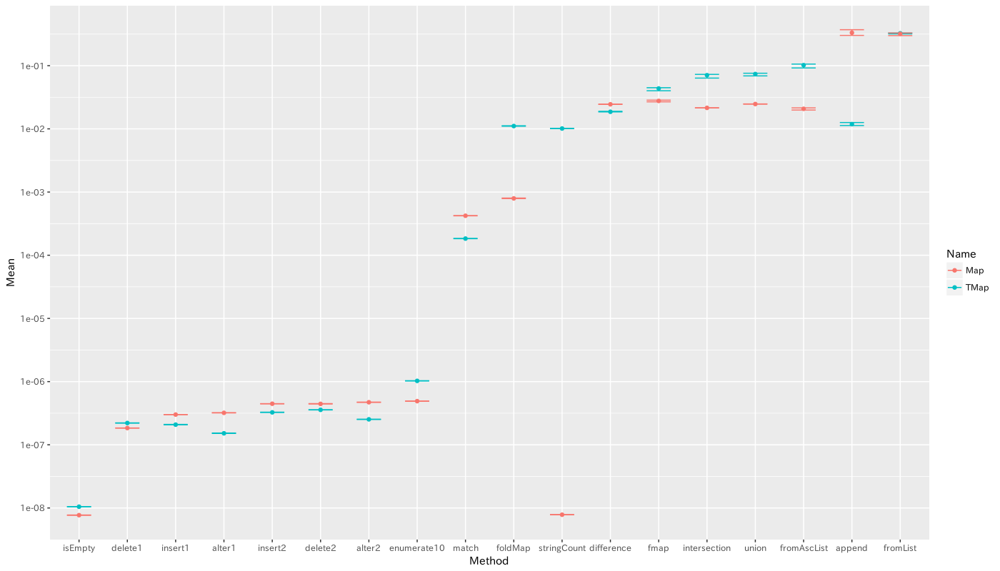
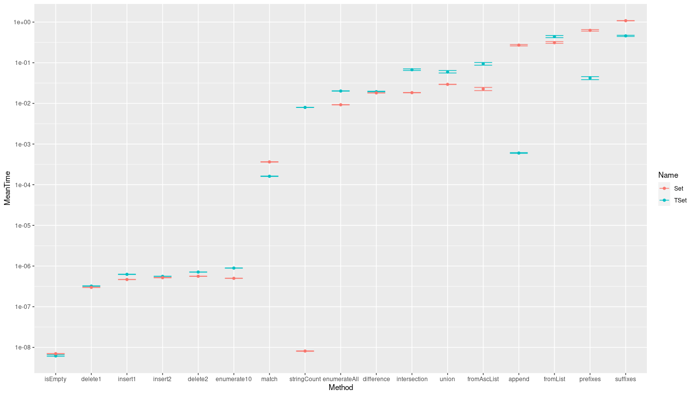

# trie-simple

Trie data structure `TMap` to hold mapping from list of characters to
something, i.e. isomorphic to `Map [c] v`.
This package also contains `TSet`, which is isomorphic to `Set` of lists of
characters.

This package implements these structures using `Map` from containers
package, and require the character type to be only `Ord`.

Advantages of using this package over `Map` or `Set` are:

  * 2x Faster `lookup` (`member`) operation
  * Retrieving subset of map or set with given prefix
  * `append`, `prefixes`, and `suffixes` support
  * Can be more memory-efficient (but not always; needs
    benchmark anyway).

[Not uploaded to Hackage yet. Haddock link is here](https://viercc.github.io/haddock/trie-simple/)

## Benchmarks

Benchmarks compared against plain `Map` and `Set`.

